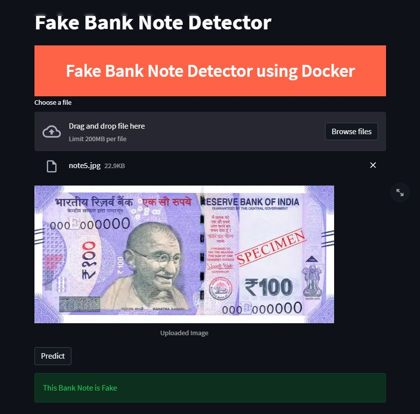

# Docker container running a Streamlit Web App for Fake Bank Note Detection

#### Contributor(s): Shubham, Yash Sethia, Ritesh Kumar 


----------
### Demo
https://fake-note-detector.herokuapp.com

### About

Docker is a platform that allows users to easily pack, distribute, and manage applications within containers. It's an open-source project that automates the deployment of applications inside software containers. Gone are the days of an IT professional saying  "*Well, it worked on my machine.*" Not it works on all of our machines.

*App.py* contains the code which creates a streamlit UI and takes the image of a Bank Note as input and calculates its variance, skewness, kurtosis and entropy of the image after transforming it into wavelets. Further, these attributes are used to classify the image as a Real note or a Fake one.

Data were extracted from images that were taken from genuine and forged banknote-like specimens. For digitization, an industrial camera usually used for print inspection was used. The final images have 400x 400 pixels. Due to the object lens and distance to the investigated object gray-scale pictures with a resolution of about 660 dpi were gained. Wavelet Transform tool was used to extract features from images.

### Build the image & run it locally
In a terminal, navigate to the folder containing the .dockerfile.
This will create a new docker image and tag it with the name of your repository, name of the image, and the version
It will take a few minutes to download & install all of the required files
```
docker build -t money_api . 
```

Run the image locally in debug mode and expose ports 5000
```
docker run -p 8501:8501 money_api
```

Push to docker hub account name/repository. This may take a few minutes
```
docker push tiwarishubham635/banknotedetector
```
Further this can be deployed on Azure, AWS, or Google Cloud Platform.
